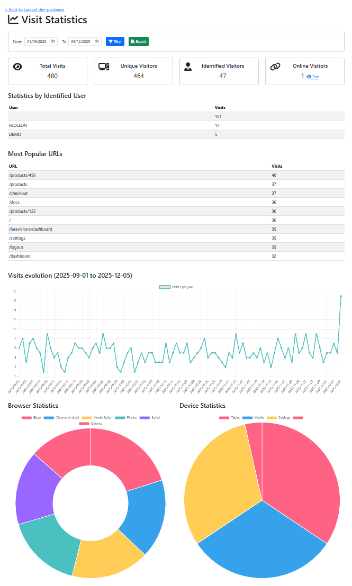

# LaraVisitors

LaraVisitors is a Laravel package that provides a dashboard and statistics for visits recorded by [shetabit/visitor](https://github.com/shetabit/visitor).

---

## ✨ Features
- Dashboard with visit statistics
- Date filters
- CSV export
- Charts (Chart.js)
- Stats by user, URL, browser, device
- Localization (EN/FR)




---

## ✅ Requirements
- Laravel 11 or higher
- PHP 8.2+

---

## 📦 Installation

Install package via Composer:

```bash
composer require fbollon/lara-visitors
```
This will also install [shetabit/visitor](https://github.com/shetabit/visitor)

---

## ⚙️ Configuration

Since this package also installs the [shetabit/visitor](https://github.com/shetabit/visitor) package, we start with its configuration

### 1. Configure **shetabit/visitor**

Publish the configuration file:

```bash
php artisan vendor:publish --provider="Shetabit\Visitor\Provider\VisitorServiceProvider" --tag="config"
```

If needed, change the default table name in `config/visitor.php`:

```php
// Name of the table where visit records should be saved
'table_name' => 'shetabit_visits',
```

Publish the migrations and run them:

```bash
php artisan vendor:publish --provider="Shetabit\Visitor\Provider\VisitorServiceProvider" --tag="migrations"
php artisan migrate
```

Add the middleware to `app/Http/Kernel.php` to automatically log visits:

```php
protected $middlewareGroups = [
    'web' => [
        // other middlewares...
        \Shetabit\Visitor\Middlewares\LogVisits::class,
    ],
];
```

Add the trait to your `User` model:

```php
use Shetabit\Visitor\Traits\Visitor;

class User extends Model {
    use Visitor;
}
```

---

### 2. Configure **fbollon/lara-visitors**

Publish the configuration file:

```bash
php artisan vendor:publish --tag=laravisitors-config
```

This will create `config/laravisitors.php` where you can customize:

- **provide_assets**: Load Bootstrap 5, Chart.js, and Font Awesome (set to `false` if your app already includes them).
- **layout**: Define the layout used by package views.
  - If you want to use the minimal layout provided by the package, you must set provide_assets to true.
- **access_middleware**: Middlewares applied to package routes.
- **visits_table**: Table name for visits (should match shetabit/visitor).
- **user_model**: Your User model class.

Optional: Publish assets (CSS/JS) if you want to customize them:

```bash
php artisan vendor:publish --tag=laravisitors-assets
```

Optional: Publish the layout if you want to override the default:

```bash
php artisan vendor:publish --tag=laravisitors-layout
```

Optional: Publish lang file, if you want to override :

```bash
php artisan vendor:publish --tag=laravisitors-translations
```
---

## 🌍 Localization
LaraVisitors supports multiple languages (EN/FR).  
To override translations:

```bash
php artisan vendor:publish --tag=laravisitors-translations
```

Files will be published to `lang/vendor/laravisitors/{locale}/messages.php`.

---

## 🔍 Usage

Access the dashboard at:

```
/laravisitors/dashboard
```


---

## ✅ Example `config/laravisitors.php`

```php
return [
    'provide_assets' => true,
    'layout' => 'laravisitors::layouts.minimal',
    'access_middleware' => ['web', 'auth', 'laravisitors.access'],
    'visits_table' => env('LARAVISITORS_TABLE', 'shetabit_visits'),
    'user_model' => env('LARAVISITORS_USER_MODEL', App\Models\User::class),
];
```

---

## 🛠 Contributing
Feel free to submit issues or pull requests on [GitHub](https://github.com/fbollon/lara-visitors).

---

## 📄 License
This package is open-sourced software licensed under the [MIT license](LICENSE).
